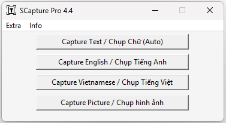

# 🚀 SCapture Pro 4.4 - Screen Capture & OCR Tool
**SCapture Pro** is a lightweight, fast and powerful screen capture tool with built-in OCR supporting both Vietnamese and English.
*SCapture Pro là công cụ chụp màn hình nhẹ, nhanh và mạnh mẽ, tích hợp OCR hỗ trợ tốt cả tiếng Việt và tiếng Anh.*

It runs directly on **Windows** — *no installation required.*
Chạy trực tiếp trên **Windows** — *không cần cài đặt.*

📸 Preview  

> Clean and simple interface with powerful OCR  
> Giao diện sạch sẽ, đơn giản nhưng OCR mạnh mẽ

### ✨ Key Features / *Tính năng nổi bật*
- Smart Auto Capture (Auto detect Vietnamese & English)
  *Chụp chữ tự động thông minh (tự nhận diện tiếng Việt & tiếng Anh)*
- Capture English & Vietnamese separately
  *Chụp riêng tiếng Anh và tiếng Việt*
- Capture Picture (Copy image to clipboard)
  *Chụp ảnh màn hình và copy vào clipboard*
- Auto remove bullets, icons, emotions and table lines
  *Tự động xóa bullet, icon, emotion và đường kẻ bảng*
- Keep original text layout
  *Giữ nguyên bố cục văn bản*
- 14-day Trial + Lifetime Full License
  *Trial 14 ngày + Bản Full vĩnh viễn*
- Press **ESC** to minimize the program
  *Bấm ESC để thu nhỏ chương trình*
- No Python required (pre-built executable)
  *Không cần cài Python (đã build sẵn file .exe)*

### 📥 Download / *Tải về*
**Latest version 4.4** (April 2026)

- **Windows**: [SCapture-Pro-4.4.exe](https://github.com/tangkhanhtoan/Scapture-Pro/releases/latest/download/SCapture-Pro-4.4.exe)

**All releases** → [Releases](https://github.com/tangkhanhtoan/Scapture-Pro/releases)

### 📖 How to use / *Hướng dẫn sử dụng*
1. Run `SCapture Pro.exe`
   *Chạy file `SCapture Pro.exe`*
2. Choose one of the capture buttons
   *Chọn một trong các nút chụp*
3. Drag your mouse to select the area
   *Kéo chuột để chọn vùng cần chụp*
4. Text/image will be automatically copied to clipboard
   *Văn bản hoặc ảnh sẽ tự động được copy vào clipboard*

**Tip:** While on the main screen, press **ESC** to minimize the program.  
*Mẹo: Khi đang ở màn hình chính, bấm phím **ESC** để thu nhỏ chương trình.*

### 🔑 License & Purchase / *License & Mua bản Full*
- **Trial**: 14 days free (automatically activated on first run)
  *Trial: 14 ngày sử dụng miễn phí (tự động kích hoạt khi chạy lần đầu)*
- **Full Version**: Lifetime, no limit, no ads – **Contact for price**
  *Bản Full: Vĩnh viễn, không giới hạn, không quảng cáo – Liên hệ để biết giá*

**How to buy and activate:**
*Cách mua và kích hoạt:*

1. Open the program → **Extra → Get HWID** (HWID is automatically copied)
   *Mở chương trình → Extra → Get HWID (HWID tự động copy vào clipboard)*
2. Send HWID to me via Zalo **0901 005 336** or email **tangkhantoan@gmail.com**
   *Gửi HWID cho tôi qua Zalo **0901 005 336** hoặc email **tangkhantoan@gmail.com***
3. I will send you a **16-character License Key**
   *Tôi sẽ gửi lại **License Key 16 ký tự***
4. Go to **Extra → Activate License** and paste the key
   *Vào Extra → Activate License → dán key*

### 📞 Contact & Support / *Liên hệ & Hỗ trợ*
- Author: Tăng Khánh Toàn
  *Tác giả: Tăng Khánh Toàn*
- Email: tangkhantoan@gmail.com
  *Email: tangkhantoan@gmail.com*
- Zalo: 0901 005 336
  *Zalo: 0901 005 336*

## ⚠️ Terms of Use / *Điều khoản sử dụng*
- This software is the intellectual property of the author.
  *Phần mềm thuộc quyền sở hữu trí tuệ của tác giả.*
- Reverse engineering or unauthorized redistribution is prohibited.
  *Cấm reverse engineering hoặc phân phối lại trái phép.*
- Commercial use requires a valid Full License.
  *Sử dụng thương mại cần có bản Full License hợp lệ.*

---
**Thank you for using SCapture Pro!** ❤️  
*Cảm ơn bạn đã sử dụng SCapture Pro! ❤️*
